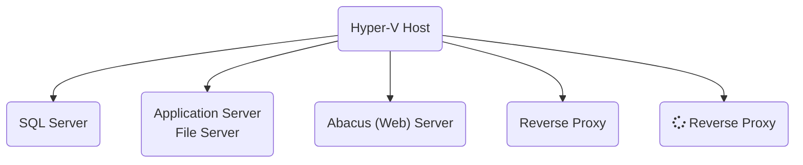

"markdown.styles": [
    "https://use.fontawesome.com/releases/v5.7.1/css/all.css"
]

# Windows

<!-- TOC -->
- [Domain](#domain)
    - [Richtlinienergebnissatz (prüfen, ob Gruppenrichtlinien greifen)](#richtlinienergebnissatz-prüfen-ob-gruppenrichtlinien-greifen)
    - [Zurücksetzen aller Verzeichnisberechtigungen](#zurücksetzen-aller-verzeichnisberechtigungen)
- [Registry](#registry)
        - [Öffnen von `HKCU` anderer lokaler User](#öffnen-von-hkcu-anderer-lokaler-user)
        - [Netzwerkumgebung ausblenden](#netzwerkumgebung-ausblenden)
<!-- /TOC -->

## Domain

### Richtlinienergebnissatz (prüfen, ob Gruppenrichtlinien greifen)

`rsop.msc`

### Zurücksetzen aller Verzeichnisberechtigungen

`ICACLS c:\freigabe\* /T /L /Q /C /RESET`

## Registry

#### Öffnen von `HKCU` anderer lokaler User

- Registry Editor mit Adminrechten öffnen
- `HKEY_USERS` auswählen
- `Datei` - `Struktur laden`
- Namen frei vergeben
- der `HKCU` Baum des User ist jetzt unter `HKEY_USERS` zu sehen

#### Netzwerkumgebung ausblenden

- Pfad `HKEY_CURRENT_USER\SOFTWARE\Microsoft\Windows\CurrentVersion\Policies\NonEnum`
  
## Nova von extern starten

- Netextender runterladen und installieren 
- https://www.sonicwall.com/de-de/products/remote-access/vpn-clients/ 
- IP mit angefügtem Port `91.249.215.146:4433`
- User `cadagentur1` und `cadagentur2`
- Domäne `kec` 

cad#-agenTUR-25  
https://cloud.kirchner-ingenieure.de/s/TkPegcTRnS5NKnk  

