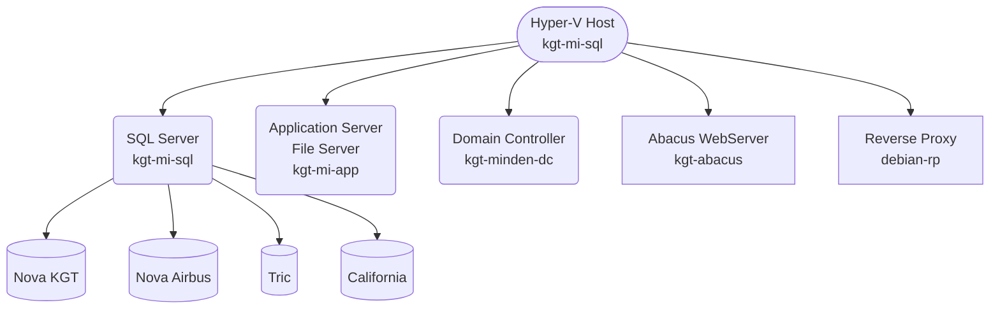

<!--- Comments are Fun --->

# Server und so...

<!-- TOC -->
- [Domain](#domain)
  - [Richtlinienergebnissatz (prüfen, ob Gruppenrichtlinien greifen)](#richtlinienergebnissatz-prüfen-ob-gruppenrichtlinien-greifen)
  - [Zurücksetzen aller Verzeichnisberechtigungen](#zurücksetzen-aller-verzeichnisberechtigungen)
- [Registry](#registry)
    - [Öffnen von `HKCU` anderer lokaler User](#öffnen-von-hkcu-anderer-lokaler-user)
    - [Netzwerkumgebung ausblenden](#netzwerkumgebung-ausblenden)
- [Rechner im Netzwerk verstecken (funktioniert nicht)](#rechner-im-netzwerk-verstecken-funktioniert-nicht)
- [Nova von extern starten](#nova-von-extern-starten)
- [Airbus Datenbank](#airbus-datenbank)
- [Verzeichnisse und Dateien mit Berechtigungen kopieren](#verzeichnisse-und-dateien-mit-berechtigungen-kopieren)
- [Verzeichnisse synchronisieren / spiegeln (in eine Richtung)](#verzeichnisse-synchronisieren--spiegeln-in-eine-richtung)
- [virtuelle Festplatte mounten](#virtuelle-festplatte-mounten)
- [Powershell](#powershell)
- [Domänenuser und Scripts anzeigen](#domänenuser-und-scripts-anzeigen)
- [STLB](#stlb)
- [Remotedesktop auf TCP umstellen](#remotedesktop-auf-tcp-umstellen)
- [Proxy anzeigen](#proxy-anzeigen)
- [Windows ohne MS-Konto installieren](#windows-ohne-ms-konto-installieren)
- [Serverübersicht](#serverübersicht)
<!-- /TOC -->

## Domain

### Richtlinienergebnissatz (prüfen, ob Gruppenrichtlinien greifen)

`rsop.msc`

### Zurücksetzen aller Verzeichnisberechtigungen

`ICACLS c:\freigabe\* /T /L /Q /C /RESET`

## Registry

#### Öffnen von `HKCU` anderer lokaler User

- Registry Editor mit Adminrechten öffnen
- `HKEY_USERS` auswählen
- `Datei` - `Struktur laden`
- Namen frei vergeben
- der `HKCU` Baum des User ist jetzt unter `HKEY_USERS` zu sehen

#### Netzwerkumgebung ausblenden

Pfad `HKEY_CURRENT_USER\SOFTWARE\Microsoft\Windows\CurrentVersion\Policies\NonEnum`

Falls `NonEnum` nicht existiert, einfach erstellen.

folgenden DWORD-Schlüssel erstellen
`{F02C1A0D-BE21-4350-88B0-7367FC96EF3C}`

hierbei den HEX-Wert auf 1 setzen

## Rechner im Netzwerk verstecken (funktioniert nicht)

`net config server /hidden:yes`

## Nova von extern starten

- Netextender runterladen und installieren 
- https://www.sonicwall.com/de-de/products/remote-access/vpn-clients/ 
- IP mit angefügtem Port `91.249.215.146:4433`
- User `cadagentur1` und `cadagentur2`
- Domäne `kec` 

Cloudzugang für die Prerequisites

> https://cloud.kirchner-ingenieure.de/s/TkPegcTRnS5NKnk  
> cad#-agenTUR-25  

## Airbus Datenbank

Port: 41456
PW: airbussql#

## Verzeichnisse und Dateien mit Berechtigungen kopieren

`robocopy \\Quellserver\Quellverzeichnis D:\Zielverzeichnis /MIR /B /R:1 /W:1 /COPYALL`

`robocopy \\Quellserver\Quellverzeichnis D:\\Zielverzeichnis /MIR /B /R:1 /W:1 /COPYALL`

## Verzeichnisse synchronisieren / spiegeln (in eine Richtung)

`robocopy`

## virtuelle Festplatte mounten

Am Besten über die Datenträgerverwaltung einbinden.

## Powershell

Powershell Scripte ausführen
```powershell
Set-ExecutionPolicy -ExecutionPolicy RemoteSigned -Scope LocalMachine
Get-ExecutionPolicy -List


Set-ExecutionPolicy
   [-ExecutionPolicy] <ExecutionPolicy>
   [[-Scope] <ExecutionPolicyScope>]
   [-Force]
   [-WhatIf]
   [-Confirm]
   [<CommonParameters>]
```

```powershell
winget install JanDeDobbeleer.OhMyPosh -s winget
(Get-Command oh-my-posh).Source
oh-my-posh get shell
notepad $PROFILE
New-Item -Path $PROFILE -Type File -Force
oh-my-posh init pwsh | Invoke-Expression
oh-my-posh init pwsh --config "$env:POSH_THEMES_PATH/jandedobbeleer.omp.json" | Invoke-Expression
install-module -name terminal-icons -repository psgallery
import
-module -name terminal-icons
install-module psreadline

Update:
winget upgrade JanDeDobbeleer.OhMyPosh -s winget
```

prüfen, ob Powershell-Remoting aktiv
```powershell
Test-WSMan
Test-WSMan kgt-mi-ps -Authentication Negotiate -Credential $cred
Get-NetTCPConnection -LocalPort 5985
Test-NetConnection -ComputerName kgt-mi-ps -Port 5985
```

Remoting aktivieren
```powershell
winrm quickconfig
```

WinRM Konfiguration anzeigen
```powershell
winrm get winrm/config/client
winrm get winrm/config/service
winrm enumerate winrm/config/listener
```

installierte Software auflisten
```powershell
Get-ItemProperty HKLM:\Software\Wow6432Node\Microsoft\Windows\CurrentVersion\Uninstall\* | Sort Displayname | Select-Object DisplayName, DisplayVersion, InstallDate, Publisher
```

Anmeldeinformationen in Variable speichern
```powershell
$cred = Get-Credential
```

Variable anzeigen
```powershell
$cred
$cred.UserName
```

mehrere Computer neu starten
```powershell
Restart-Computer -ComputerName RemoteDevice1, RemoteDevice2, RemoteDevice3 -Credential $creds

$devices = Get-Content -Path C:\listOfServers.txt
Restart-Computer -ComputerName $devices -Credential $Creds -Force
```

Remotesession öffnen
```powershell
Enter-PSSession rechner1 -Credential $cred
```

Sessions zu mehreren Computern herstellen
```powershell
$credential = Get-Credential
$multiSession = New-PSSession -ComputerName RemoteDeviceName1, RemoteDeviceName2, RemoteDeviceName3 -Credential $credential

$devices = Get-Content -Path C:\listOfServers.txt
$credential = Get-Credential
$multiSession = New-PSSession -ComputerName $devices -Credential $credential
```

Verschiedenes
```powershell
$session = New-PSSession -ComputerName kgt-mi-ps -Credential $cred
Invoke-Command -Session $session -ScriptBlock {hostname}

$sessionOptions = New-PSSessionOption -SkipCNCheck -SkipCACheck -SkipRevocationCheck
$advancedSession = New-PSSession -ComputerName 10.0.3.27 -Credential user -UseSSL -SessionOption $so

Anzahl der Prozessoren anzeigen
Invoke-Command -Session $sessions -ScriptBlock { (Get-CimInstance Win32_ComputerSystem).NumberOfLogicalProcessors }

RAM jedes angegebenen Rechners anzeigen
Invoke-Command -Session $sessions -ScriptBlock { Get-CimInstance Win32_OperatingSystem | Measure-Object -Property TotalVisibleMemorySize -Sum | ForEach-Object { [Math]::Round($_.sum / 1024 / 1024) } }

freien Speicherplatz auf c: aller angegebenen Rechner anzeigen
Invoke-Command -Session $sessions -ScriptBlock {
    $driveData = Get-PSDrive C | Select-Object Used, Free
    $total = $driveData.Used + $driveData.Free
    $calc = [Math]::Round($driveData.Free / $total, 2)
    $perFree = $calc * 100
    return $perFree
}

Anzahl der logischen CPUs anzeigen
Invoke-Command -Session $sessions -ScriptBlock { (Get-CimInstance Win32_ComputerSystem).NumberOfLogicalProcessors }

Dienst BITS auf allen Rechnern beenden
Invoke-Command -Session $sessions -ScriptBlock { Stop-Service BITS -Force }

Get-Process pccntmon, system, nova, arriba, bricscad, tmlisten, tmbmsrv, tmccsf, tmpfw, ntrtscan, cetasvc  | select Name, Description, CPU, FileVersion, Company | Out-GridView

Computer herunterfahren
Stop-Computer
```

Mit `Get-ChildItem` können Sie alle Elemente in einem Ordner direkt abrufen. Fügen Sie den optionalen Parameter *Force* hinzu, um ausgeblendete oder Systemelemente anzuzeigen. Dieser Befehl zeigt z. B. den unmittelbaren Inhalt des PowerShell-Laufwerks `C:` an.

```powershell
Get-ChildItem -Path C:\ -Force
```

Um Elemente in Unterordnern anzuzeigen, müssen Sie den Recurse-Parameter angeben. Der folgende Befehl listet alle Elemente auf dem Laufwerk `C:` auf:

```powershell
Get-ChildItem -Path C:\ -Force -Recurse
```

Der folgende Befehl sucht alle ausführbaren Dateien im Ordner „Programme“, die nach dem 1. Oktober 2005 zuletzt geändert wurden und weder kleiner als 1 MB noch größer als 10 MB sind:
```powershell
Get-ChildItem -Path $env:ProgramFiles -Recurse -Include *.exe |
    Where-Object -FilterScript {
        ($_.LastWriteTime -gt '2005-10-01') -and ($_.Length -ge 1mb) -and ($_.Length -le 10mb)
    }
```


Dieser Befehl kopiert den Ordner `C:\temp\test1` rekursiv in den neuen Ordner `C:\temp\DeleteMe`:
```powershell
Copy-Item C:\temp\test1 -Recurse C:\temp\DeleteMe
```

Sie können auch eine Auswahl von Elementen kopieren. Der folgende Befehl kopiert alle .txt-Dateien, die an beliebiger Stelle in `C:\data` enthalten sind, nach `C:\temp\text`:
```powershell
Copy-Item -Filter *.txt -Path c:\data -Recurse -Destination C:\temp\text
```

Remotesession verlassen
```powershell
Exit-PSSession
```

installierte Software auflisten
```powershell
Get-ItemProperty HKLM:\Software\Wow6432Node\Microsoft\Windows\CurrentVersion\Uninstall\* | Sort Displayname | Select-Object DisplayName, DisplayVersion, InstallDate, Publisher
```

Ordner erstellen
```powershell
New-Item -Name "ordner" -ItemType Directory
New-Item -Name “Testordner” -ItemType Directory -Path “C:\Temp\”
```

Datei erstellen
```powershell
New-Item -Name “Dateiname.txt” -ItemType File -Path “C:\Temp\”
New-Item -Name “computerlist.txt” -ItemType File -Path “C:\inst\”
```

leere Ordner löschen
```powershell
$alleordneranzeigen=Get-ChildItem -Path “C:\Temp\” -Directory -Recurse
foreach($ordner in $alleordneranzeigen)
{
    if(($ordner | Get-ChildItem -Recurse).Count -eq 0)
    {
      Remove-Item -Path $ordner.FullName
    }
}
```

Ordner löschen
```powershell
Remove-Item -Path “C:\Temp\Testordner1\”
```

Wenn Sie nicht für jedes enthaltene Element aufgefordert werden möchten, geben Sie den Recurse-Parameter an:
```powershell
Remove-Item -Path C:\temp\DeleteMe -Recurse
```

Remoterechner neu starten
```powershell
Restart-Computer -ComputerName kgt-mi-hun868nb -Credential $cred -Force
Restart-Computer -ComputerName kgt-mi-bar873 -Credential $cred -Force
```

Environment-Variablen
```powershell
$env:COMPUTERNAME
$env:USERDOMAIN
```

Sie können mithilfe des Befehls New-PSDrive auch einen lokalen Ordner zuordnen. Der folgende Befehl erstellt ein lokales Laufwerk P: im lokalen Verzeichnis „Programme“, das nur in der PowerShell-Sitzung sichtbar ist:
```powershell
New-PSDrive -Name P -Root $env:ProgramFiles -PSProvider FileSystem
```

Wie bei Netzlaufwerken sind in PowerShell zugeordnete Laufwerke für die PowerShell-Shell sofort sichtbar. Verwenden Sie den Persist-Parameter, um ein zugeordnetes Laufwerk zu erstellen, das im Datei-Explorer sichtbar ist. Mit Persist können aber nur Remotepfade verwendet werden.

Eine der häufigeren Speicherformate für Textdaten ist eine Datei mit separaten Zeilen, die als einzelne Datenelemente behandelt werden. Das Cmdlet Get-Content kann zum Lesen einer vollständigen Datei in einem Schritt verwendet werden, wie hier gezeigt:

```powershell
Get-Content -Path $PROFILE
# Load modules and change to the PowerShell-Docs repository folder
Import-Module posh-git
Set-Location C:\Git\PowerShell-Docs
```

`Get-Content` behandelt die aus der Datei gelesenen Daten als Array, mit je einem Element pro Zeile des Dateiinhalts. Sie können dies anhand der Länge (Length) des zurückgegebenen Inhalts überprüfen:

```powershell
PS> (Get-Content -Path $PROFILE).Length
3
```

Dieser Befehl ist besonders hilfreich zum Abrufen von Listen mit Informationen in PowerShell. Beispielsweise können Sie eine Liste mit Computernamen oder IP-Adressen in der Datei `C:\temp\domainMembers.txt` speichern, wobei in jede Zeile der Datei je ein Name geschrieben wird. Mit `Get-Content` können Sie die Dateiinhalte abrufen und in die Variable `$Computers` einfügen:

```powershell
$Computers = Get-Content -Path C:\temp\DomainMembers.txt
```

`$Computers` ist jetzt ein Array mit einem Computernamen in jedem Element.

Nachricht an Computer senden
msg * /server:192.168.178.10 "Deine Nachricht"
Start-Sleep 4
msg * /server:kgt-mi-hun868nb /time:1 "Ahwas?"
Start-Sleep 4
msg * /server:kgt-mi-ps /time:1 "Wieso?"
Start-Sleep -Milliseconds 500
msg * /server:kgt-mi-ps /time:1 "Wieso?"
Start-Sleep -Milliseconds 500
msg * /server:kgt-mi-ps /time:1 "Wieso?"

(New-Object -com "wmplayer.ocx.7").cdromcollection.item(0).eject()


```powershell
Get-LocalUser
Get-LocalUser -Name kirchner
```

Passwort von lokalem User ändern
```powershell
$Password = Read-Host -AsSecureString
$UserAccount = Get-LocalUser -Name "kirchner"
$UserAccount | Set-LocalUser -Password $Password
```

## GIT Silentinstall
Switches: /SP- /VERYSILENT /SUPPRESSMSGBOXES /NORESTART


## Domänenuser und Scripts anzeigen

```
dsquery * domainroot -filter "(&(objectCategory=Person)(objectClass=User))" -limit 0 -attr sAMAccountName sn givenName scriptpath distinguishedName > C:\Loginscript.txt
```


## STLB

Setzen Sie den Haken vor „EasyLogin unterstützt“ und Schließen Sie das Freigabecenter. 
Anschließend muss im Internet Informationsdienste Manager der Anwendungspool 
„SBAPI.AppPool“ einmal beendet und neu gestartet werden. 
Danach ist in Ihrem STLB-Bau Server die „Easy Login“ Funktion aktiviert und kan
n von der AVA Software verwendet 
werden.
Das Aktivieren der „Easy Login“ Funktion sorgt technisch dafür, dass 
bei einer Anmeldung 
am STLB
-
Bau mit eine
m unbekannten Nutzernamen, dieser Nutzer autom
a
tisch durch 
STLB
-
Bau als neuer Nutzer angelegt wird und anschließend im STLB
-
Bau arbeiten kann
.

## Remotedesktop auf TCP umstellen

```
Computer\HKEY_LOCAL_MACHINE\SOFTWARE\Policies\Microsoft\Windows NT\Terminal Services\Client
```

Hier muss ein weiterer Registry-Wert mit dem Namen `fClientDisableUDP` angelegt werden. Diesem neuen DWORD 32-Bit Wert „fClientDisableUDP“ müsst Ihr dann noch den Wert „1“ zuweisen.

## Proxy anzeigen

`netsh winhttp show proxy`

## Windows ohne MS-Konto installieren

1. Bei der Installation Sprache und Keyboardlayout auswählen.
2. Wenn nach dem WLAN gefragt wird, Shift+F10 drücken. Dadurch wird eine Shell geöffnet.
3. `oobe\BypassNRO` eingeben.
4. Rechner startet neu. "Ich habe kein Internet" und "Mit eingeschränkter Einrichtung fortfahren" auswählen


## Serverübersicht




<!---
$${\small \text{Font size is small, eg. $\sum{x_i = 10}$}}$$

inline $\LARGE \text{Hello!}$

$\small Hello!$

$\text{\.{V}=10}$

Der Volumentstrom $\small \text{\.{V}}$ beträgt 200m³/h ${m^3}

$\Huge Hello!$
$\huge Hello!$
$\LARGE Hello!$
$\Large Hello!$
$\large Hello!$
$\normalsize Hello!$
$\small Hello!$
$\scriptsize Hello!$
$\tiny Hello!$
--->


<!---
test $\ \.{V}=10$

$\sqrt{3x-1}+(1+x)^2$  
$$\sqrt{3x-1}+(1+x)^2$$
--->

<!--- <br> für Zeilenumbruch. \n geht auch, sollte man aber nicht nutzen --->


