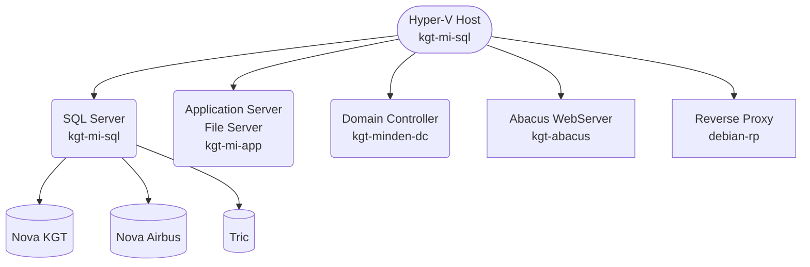

<!--- Comments are Fun --->

# Server und so...

<!-- TOC -->
- [Server und so...](#server-und-so)
  - [Domain](#domain)
    - [Richtlinienergebnissatz (prüfen, ob Gruppenrichtlinien greifen)](#richtlinienergebnissatz-prüfen-ob-gruppenrichtlinien-greifen)
    - [Zurücksetzen aller Verzeichnisberechtigungen](#zurücksetzen-aller-verzeichnisberechtigungen)
  - [Registry](#registry)
      - [Öffnen von `HKCU` anderer lokaler User](#öffnen-von-hkcu-anderer-lokaler-user)
      - [Netzwerkumgebung ausblenden](#netzwerkumgebung-ausblenden)
  - [Rechner im Netzwerk verstecken](#rechner-im-netzwerk-verstecken)
  - [Nova von extern starten](#nova-von-extern-starten)
  - [Verzeichnisse und Dateien mit Berechtigungen kopieren](#verzeichnisse-und-dateien-mit-berechtigungen-kopieren)
  - [Verzeichnisse synchronisieren / spiegeln (in eine Richtung)](#verzeichnisse-synchronisieren--spiegeln-in-eine-richtung)
  - [virtuelle Festplatte mounten](#virtuelle-festplatte-mounten)
  - [Powershell](#powershell)
  - [Serverübersicht](#serverübersicht)
<!-- /TOC -->

## Domain

### Richtlinienergebnissatz (prüfen, ob Gruppenrichtlinien greifen)

`rsop.msc`

### Zurücksetzen aller Verzeichnisberechtigungen

`ICACLS c:\freigabe\* /T /L /Q /C /RESET`

## Registry

#### Öffnen von `HKCU` anderer lokaler User

- Registry Editor mit Adminrechten öffnen
- `HKEY_USERS` auswählen
- `Datei` - `Struktur laden`
- Namen frei vergeben
- der `HKCU` Baum des User ist jetzt unter `HKEY_USERS` zu sehen

#### Netzwerkumgebung ausblenden

- Pfad `HKEY_CURRENT_USER\SOFTWARE\Microsoft\Windows\CurrentVersion\Policies\NonEnum`

## Rechner im Netzwerk verstecken

`net config server /hidden:yes`

## Nova von extern starten

- Netextender runterladen und installieren 
- https://www.sonicwall.com/de-de/products/remote-access/vpn-clients/ 
- IP mit angefügtem Port `91.249.215.146:4433`
- User `cadagentur1` und `cadagentur2`
- Domäne `kec` 

Cloudzugang für die Prerequisites

> https://cloud.kirchner-ingenieure.de/s/TkPegcTRnS5NKnk  
> cad#-agenTUR-25  

## Verzeichnisse und Dateien mit Berechtigungen kopieren

`robocopy \\Quellserver\Quellverzeichnis D:\Zielverzeichnis /MIR /B /R:1 /W:1 /COPYALL`

`robocopy \\Quellserver\Quellverzeichnis D:\\Zielverzeichnis /MIR /B /R:1 /W:1 /COPYALL`

## Verzeichnisse synchronisieren / spiegeln (in eine Richtung)

`robocopy`

## virtuelle Festplatte mounten

Am Besten über die Datenträgerverwaltung einbinden.

## Powershell

```
winget install JanDeDobbeleer.OhMyPosh -s winget
(Get-Command oh-my-posh).Source
oh-my-posh get shell
notepad $PROFILE
New-Item -Path $PROFILE -Type File -Force
oh-my-posh init pwsh | Invoke-Expression
```

## Serverübersicht




<!---
$${\small \text{Font size is small, eg. $\sum{x_i = 10}$}}$$

inline $\LARGE \text{Hello!}$

$\small Hello!$

$\text{\.{V}=10}$

Der Volumentstrom $\small \text{\.{V}}$ beträgt 200m³/h ${m^3}

$\Huge Hello!$
$\huge Hello!$
$\LARGE Hello!$
$\Large Hello!$
$\large Hello!$
$\normalsize Hello!$
$\small Hello!$
$\scriptsize Hello!$
$\tiny Hello!$
--->


<!---
test $\ \.{V}=10$

$\sqrt{3x-1}+(1+x)^2$  
$$\sqrt{3x-1}+(1+x)^2$$
--->

<!--- <br> für Zeilenumbruch. \n geht auch, sollte man aber nicht nutzen --->


